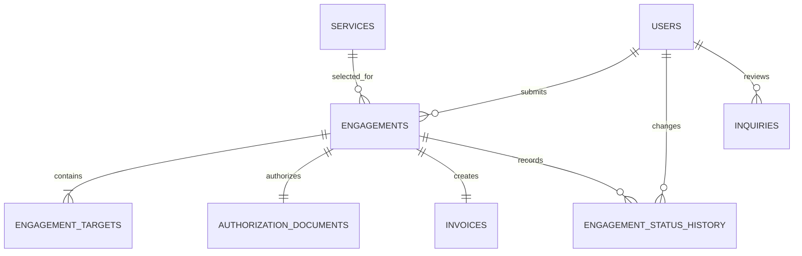

# Oracle Red Labs Software Requirements Specification

**Version:** 1.0  
**Status:** Implemented academic scope  
**Last updated:** 2026-10-02

## 1. Purpose

Oracle Red Labs is a fictional academic full-stack application. It demonstrates a complete transaction from account registration through an authorized engagement request, database persistence, client tracking, and administrator review. The application never performs security testing, collects card details, or contacts real targets.

The original concept remains in `business-proposal.md`. This document defines the smaller system that is implemented and assessable.

## 2. Product scope

```text
Register or sign in
  -> choose an active service
  -> submit scope, targets, schedule, billing preference, and signed PDF
  -> persist the complete engagement in MySQL
  -> client tracks the engagement
  -> administrator reviews and updates it
  -> client sees the same persisted result
```

### 2.1 Users

| Role | Capabilities |
|---|---|
| Guest | Browse services and resources, submit an inquiry, register, sign in |
| Client | Create engagements, read only owned engagements, view history, cancel eligible engagements |
| Administrator | Manage services and resources, review inquiries, inspect all engagements and protected documents, update engagement and invoice states |

Public registration always creates a client. An administrator is created only through the environment-driven seed command.

### 2.2 Technology

- Existing semantic HTML, CSS, and plain browser JavaScript
- Node.js 24 or newer and Express 5
- MySQL 8.4 with InnoDB and `utf8mb4`
- `mysql2` parameterized SQL, with no ORM
- MySQL-backed Express sessions and `bcryptjs` password hashing
- `multer` PDF uploads outside the public directory
- `express-validator`, Helmet, CSRF tokens, and request rate limits
- Node test runner and Supertest

Express serves the existing front end and the `/api` routes from one origin.

## 3. Functional requirements and implementation evidence

| ID | Requirement | Main implementation |
|---|---|---|
| FR-01 | Return the active service catalogue | `GET /api/services`, service cards in `frontend/js/main.js` |
| FR-02 | Return and filter published resources | `GET /api/resources`, `frontend/js/vault-filter.js` |
| FR-03 | Persist public inquiries | `POST /api/inquiries`, contact and home forms |
| FR-04 | Register a client account | `POST /api/auth/register` |
| FR-05 | Authenticate clients and administrators | `POST /api/auth/login`, server session |
| FR-06 | Enforce session, role, and ownership | API middleware and owner-constrained SQL |
| FR-07 | Submit engagement details and signed PDF | `POST /api/engagements` multipart transaction |
| FR-08 | Return a unique `ORL-######` receipt | Server reference generator and unique constraint |
| FR-09 | Show only the current client's engagements | dashboard plus `GET /api/engagements` |
| FR-10 | Show engagement details and history | detail page plus `GET /api/engagements/:reference` |
| FR-11 | Cancel owned pending or scoping engagement | `PATCH /api/engagements/:reference/cancel` |
| FR-12 | Administer service records | admin service CRUD routes and controls |
| FR-13 | Administer resource records | admin resource CRUD routes and controls |
| FR-14 | Administer engagements, invoices, and PDFs | admin engagement routes and controls |
| FR-15 | Review, close, and delete inquiries | admin inquiry routes and controls |
| FR-16 | Record every engagement status change | `engagement_status_history` transaction writes |
| FR-17 | Destroy the session on logout | `POST /api/auth/logout` |
| FR-18 | Return safe, structured errors | central JSON error handler and UI status regions |

## 4. Business rules

- Emails are normalized to lowercase and are unique.
- Passwords contain 12 to 72 characters. Password hashes are the only password representation stored.
- A client must be authenticated to open or submit an engagement request.
- The chosen service must be active at submission time.
- Scope contains 40 to 5,000 characters.
- An engagement has 1 to 100 targets. Each target occupies one line and contains no more than 255 characters.
- Requested start time is at least 24 hours in the future.
- The authorization file has PDF MIME type, a `%PDF-` signature, and a maximum size of 5 MB.
- The authorization acknowledgment is mandatory.
- A purchase order number is mandatory for purchase-order billing.
- Service price is copied into the engagement and invoice at booking time.
- Engagement reference codes are generated by the server and protected by a unique database constraint.
- Clients may cancel only `pending` or `scoping` engagements.
- Administrators may move engagement states only along these paths:

```text
pending -> scoping -> active -> completed
pending -> cancelled
scoping -> cancelled
active -> cancelled
```

- Invoice states follow:

```text
not_issued -> outstanding -> paid
not_issued -> cancelled
outstanding -> cancelled
```

`completed`, `paid`, and both `cancelled` states are terminal.

## 5. Data design

### 5.1 Conventions

- Production database: `oracle_red_labs`
- Test database: `oracle_red_labs_test`
- Engine and collation: InnoDB, `utf8mb4_0900_ai_ci`
- Numeric primary keys are unsigned auto-increment values.
- Currency values use `DECIMAL(12,2)` and USD.
- Application dates are handled as UTC.
- PDF contents are stored under `backend/uploads/authorizations`; MySQL stores metadata and SHA-256.
- All variable SQL values use placeholders.

### 5.2 Entity relationship diagram



### 5.3 Data dictionary

| Table | Purpose | Important constraints |
|---|---|---|
| `users` | Client and administrator identities | unique email; role enum; deactivation instead of deletion |
| `services` | Bookable catalogue | unique name and slug; nonnegative price; active flag |
| `resources` | Public vault entries | unique slug; category enum; published flag |
| `inquiries` | Public contact submissions | new/reviewed/closed state; optional admin reviewer |
| `engagements` | Main transaction | unique reference; owner and service FKs; immutable price snapshot |
| `engagement_targets` | Ordered target list | cascades with engagement; unique sort order per engagement |
| `authorization_documents` | Private PDF metadata | one per engagement; unique randomized stored filename and SHA-256 |
| `invoices` | Demonstration billing state | one per engagement; amount snapshot and state enum |
| `engagement_status_history` | Audit trail | old/new states, acting user, note, timestamp |
| `sessions` | Server-side login sessions | JSON session payload with automatic expiry cleanup |

The production and test executable specifications are in `database/schema.sql` and `database/test-schema.sql`. Demonstration catalogue data is in `database/seed.sql`.

## 6. API specification

### 6.1 Response format

```json
{ "data": {}, "message": "Optional message" }
```

```json
{
  "error": {
    "code": "VALIDATION_ERROR",
    "message": "Check the highlighted fields.",
    "fields": { "email": "Enter a valid email address." }
  }
}
```

JSON properties use `snake_case`. Dates are returned as UTC values by the MySQL connection.

### 6.2 Routes

| Access | Method | Path | Purpose |
|---|---|---|---|
| Public | GET | `/api/auth/csrf-token` | Create/reuse session and issue token |
| Public | POST | `/api/auth/register` | Register client and sign in |
| Public | POST | `/api/auth/login` | Sign in |
| User | POST | `/api/auth/logout` | Destroy session |
| User | GET | `/api/auth/me` | Return current user |
| Public | GET | `/api/services` | Active services |
| Public | GET | `/api/resources` | Published resources |
| Public | POST | `/api/inquiries` | Create inquiry |
| Client | POST | `/api/engagements` | Create multipart engagement |
| Client | GET | `/api/engagements` | List owned engagements |
| Client | GET | `/api/engagements/:reference` | Read owned engagement |
| Client | PATCH | `/api/engagements/:reference/cancel` | Cancel eligible engagement |
| Admin | GET/POST | `/api/admin/services` | List/create services |
| Admin | PUT/DELETE | `/api/admin/services/:id` | Replace/delete unused service |
| Admin | GET/POST | `/api/admin/resources` | List/create resources |
| Admin | PUT/DELETE | `/api/admin/resources/:id` | Replace/delete resource |
| Admin | GET | `/api/admin/engagements` | List all engagements |
| Admin | GET | `/api/admin/engagements/:reference` | Full engagement detail |
| Admin | PATCH | `/api/admin/engagements/:reference/status` | Transition engagement |
| Admin | PATCH | `/api/admin/engagements/:reference/invoice` | Transition/update invoice |
| Admin | GET | `/api/admin/engagements/:reference/authorization` | Download private PDF |
| Admin | GET | `/api/admin/inquiries` | List inquiries |
| Admin | PATCH | `/api/admin/inquiries/:id/status` | Review or close inquiry |
| Admin | DELETE | `/api/admin/inquiries/:id` | Delete inquiry |

Every state-changing route requires a valid CSRF token. Protected routes additionally require the correct session role.

## 7. Quality requirements

- **Security:** server sessions, HttpOnly SameSite cookies, bcrypt cost 12, CSRF checks, rate limits, ownership queries, Helmet headers, parameterized SQL, generic login failures, randomized private filenames.
- **Privacy:** authorization documents are outside the static directory and are downloadable only by administrators.
- **Accessibility:** semantic structure, labels, live status messages, visible focus, keyboard tabs, 44 px controls, contrast, and reduced motion.
- **Responsive design:** public and application screens support approximately 360 px, 768 px, and desktop widths.
- **Reliability:** engagement creation, cancellation, and status history changes use database transactions.
- **Maintainability:** routes, middleware, database access, and browser page modules are separated. SQL remains visible for assessment.
- **Honesty:** company details and demonstration data are identified as fictional. The product does not claim encryption, payment processing, automated attacks, real findings, or report generation.

## 8. Proposal versus final scope

The proposal's service names and authorization-first positioning remain. PHANTASM is presented as a controlled human-led engagement rather than an autonomous attack platform. ORACLE and CHAINBREAK descriptions are limited to catalogue and booking use; the application does not execute their technical claims.

The following remain future enhancements because they exceed the academic CRUD transaction or require production infrastructure and legal controls:

- Stripe payments and subscriptions
- Offensive-security automation or target interaction
- Live attack dashboards, findings, pentest reports, and vulnerability retests
- Email verification, password recovery, and outbound notifications
- PGP encryption and a Tor mirror
- Real compliance badges or certifications
- Multi-user organizations, staff assignment, and workforce scheduling

## 9. Acceptance and traceability

The primary acceptance scenario is:

1. A client registers and signs in.
2. The client submits a valid engagement and signed PDF.
3. MySQL contains the engagement, targets, document metadata, invoice, and initial history record.
4. The client sees the record on the dashboard and detail page.
5. An administrator sees it and downloads the protected authorization.
6. The administrator moves it from `pending` to `scoping`.
7. The client refreshes and sees `scoping` and the audit entry.
8. The administrator moves the invoice to `outstanding`.
9. The client sees the updated invoice state.
10. The administrator demonstrates service/resource CRUD and inquiry management.

Setup, automated checks, manual test cases, and presentation steps are maintained in `README.md`, `docs/TESTING.md`, and `docs/PRESENTATION.md`.

## 10. Current implementation status

Milestones 1 through 9 are represented in the repository: reconciled scope, planning artifacts, application screens and states, browser API integration, repeatable database scripts, Express routes, authentication, uploads, CRUD, automated checks, and a manual acceptance checklist. The schema and complete transaction passed against an isolated MySQL 8.0.42 instance; the documented target remains MySQL 8.4. Final presentation screenshots and recording must be produced in the instructor's presentation environment.
