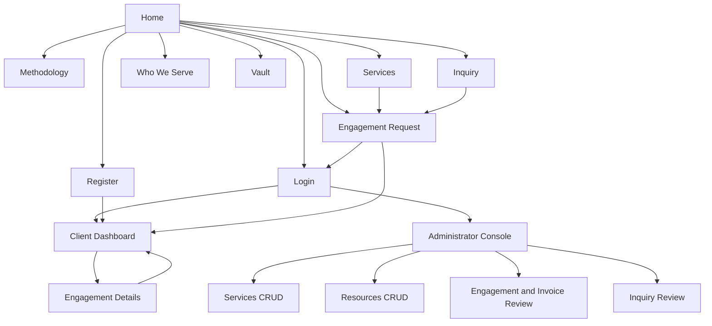

# Milestone 2: As-Built Sitemap and Navigation

## Sitemap

## Page inventory

| Page | Audience | Authentication | Main destinations |
|---|---|---|---|
| `index.html` | Public | None | Public content, inquiry, services, engagement |
| `methodology.html` | Public | None | Services, inquiry, engagement |
| `services.html` | Public | None | Service-specific engagement request |
| `who-we-serve.html` | Public | None | Services and inquiry |
| `vault.html` | Public | None | Search and filter published resources |
| `contact.html` | Public | None | Persist an inquiry |
| `register.html` | Guest | None | Create client session, then dashboard |
| `login.html` | Guest | None | Client dashboard or admin console by role |
| `engage.html` | Client | Client | Submit request, then dashboard |
| `dashboard.html` | Client | Client | Owned engagement details and cancellation |
| `engagement-details.html` | Client | Client and owner | History, scope, targets, billing, cancellation |
| `admin.html` | Administrator | Admin | Service/resource CRUD, engagement/invoice states, inquiries |

## Navigation rules

1. The public header remains consistent across pages.
2. When authenticated, Log In becomes the role-appropriate dashboard and Register becomes Log Out.
3. Opening a protected page while signed out redirects to `login.html` with an allow-listed local `next` value.
4. A client entering the administrator page is redirected to the client dashboard. An administrator entering a client-only page is redirected to the administrator console.
5. Engagement detail links use a server-generated reference in the query string.
6. Browser history and ordinary links remain usable; the site is not a single-page application.

## Design concept

The interface uses the existing Oracle Red Labs black-and-red technical identity documented in `DESIGN.md`. Public pages tell the fictional company story, while client and administrator screens reuse the same tokens for legible, task-focused records and forms. Red is reserved for primary action, current state, and risk-related emphasis. Every page visibly identifies the project as fictional academic work.
